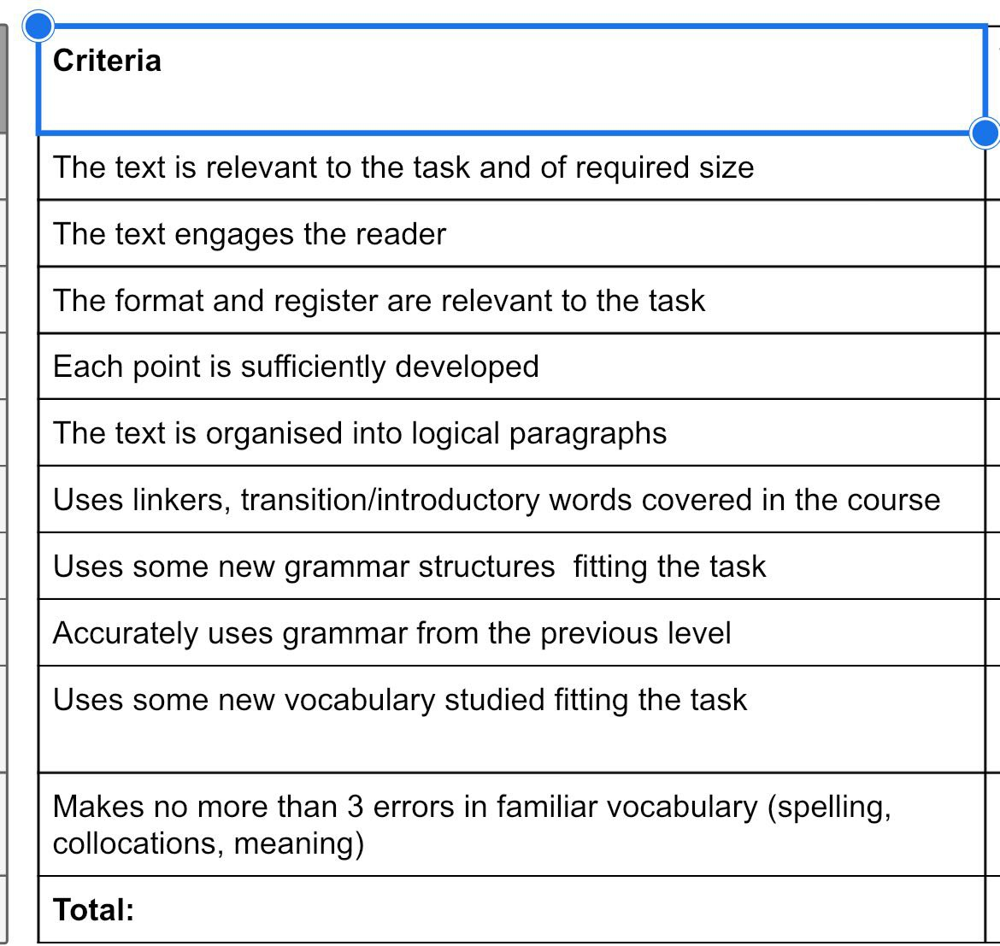

```
Task 3

Learning how to spot fake news has recently become a part of school curriculum in many countries. What do you think the advantages and risks of such a programme can be? Write an essay expressing your opinion.

In your essay you should:
●    have a clear introduction and conclusion stating your opinion
●    present arguments clearly with a separate paragraph for each advantage/risk
●            support your arguments 
●    use appropriate expressions to introduce an argument
●    use a range of topical grammar and vocabulary

Write 180-200 words.
```

ВВЕДЕНИЕ
в наше время ...
фейковые нвоости могут ...
МНЕНИЕ
нужно убрать
ЗА


с другой стороны, дети могут иметь безответственных родителей
и вообще, многое зависит от учителя
ЗАКЛЮЧЕНИЕ
такие уроки как бжд и физкультура не должны быть обязательнымои в университете однако это всегда круто когда университет предоставляет такие возможности


