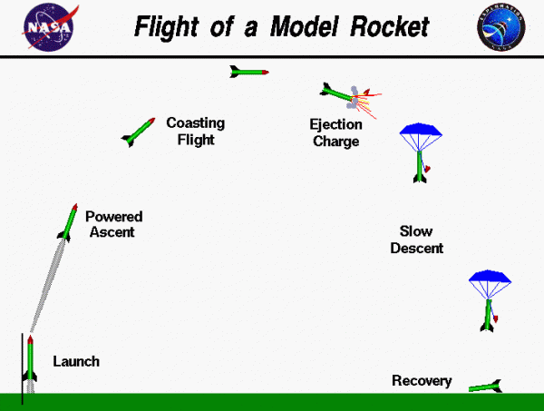

# Лабораторная №4
## Задание

В которой нужно доработать лабораторную №3, 
реализовав 2 собственных класса исключений
checked и unchecked, а также их обработку исключений этих классов.
Также в программу требуется добавить:
- [x] локальные классы
- [ ] анонимные классы
- [x] вложенные классы

## ПМИшные комментарии:
- [ ] NULL CHECK
- [ ] private final -> public
- [ ] случайные числа в main
- [ ] геттеры вообще не нужны где-то
- [ ] StringBuilder
- [ ] убрать инициализацию строки, её вообще сразу можно возвращать
- [ ] equals -> hash
- [ ] УБРАТЬ КОПИПАСТУ: разобраться с сервисами: сейчас сервисы подсчета массы и высоту выполняют одну функцию -> AccumulativeSerivice
- [ ] для вектора реализовать set() убрать конструктор vector
- [ ] разобраться с calcMovement

## Что мне не нравится:
- [ ] слишком много импортов в rocket. почитать:
    - https://www.youtube.com/watch?v=FyCYva9DhsI&t=1674s
    - https://stackoverflow.com/questions/8485689/too-many-imports-are-spamming-my-java-code
    - https://stackoverflow.com/questions/147454/why-is-using-a-wild-card-with-a-java-import-statement-bad

## Материалы
[Мой конспект](https://www.figma.com/file/hOuMEJWxsm1P3NWnyoEWed/%D0%9F%D1%80%D0%BE%D0%B3%D1%80%D0%B0%D0%BC%D0%BC%D0%B8%D1%80%D0%BE%D0%B2%D0%B0%D0%BD%D0%B8%D0%B5?type=whiteboard&node-id=1-20&t=X9sA1AGvbd4dSVTT-4)

Использованные статьи:
- https://habr.com/ru/companies/golovachcourses/articles/223821/
- https://habr.com/ru/companies/golovachcourses/articles/225585/

### 