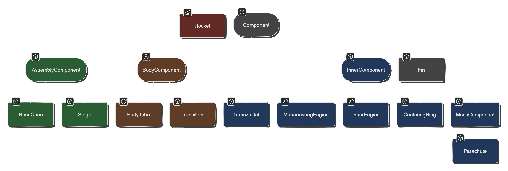

# Лабораторная №4
- [Лабораторная №4](#лабораторная-4)
  - [Задание](#задание)
  - [Схемы](#схемы)
    - [Наследование компонентов ракеты](#наследование-компонентов-ракеты)
    - [Композиция ракеты](#композиция-ракеты)
    - [Стадии полёта ракеты](#стадии-полёта-ракеты)
  - [Комментарии и идеи](#комментарии-и-идеи)
    - [ПМИшные комментарии:](#пмишные-комментарии)
    - [Что мне не нравится:](#что-мне-не-нравится)
  - [Материалы](#материалы)

## Задание

В которой нужно доработать лабораторную №3, 
реализовав 2 собственных класса исключений
checked и unchecked, а также их обработку исключений этих классов.
Также в программу требуется добавить:
- [x] локальные классы
- [ ] анонимные классы
- [x] вложенные классы

## Схемы
### Наследование компонентов ракеты

Подробнее: https://app.eraser.io/workspace/a1ddOea1jwJJCEwztSbC?elements=CUuNWfsUtwZ1Eq6dRdUbKg

### Композиция ракеты

### Стадии полёта ракеты

## Комментарии и идеи

### ПМИшные комментарии:
- [x] NULL CHECK:
  - https://youtu.be/32r-5a-6bz4?si=CPlQkh8hsOWv3bq-
  - https://youtu.be/_z0xB2-swYY?si=S0MpoEJp5R1rGF7y
- [x] private final -> public
- [x] magic numbers в main:
    - точно ли надо фиксить? ладно, потом всё равно из json читать
- [x] геттеры вообще не нужны где-то
- [ ] StringBuilder
- [ ] убрать инициализацию строки, её вообще сразу можно возвращать
- [ ] equals -> hash
- [x] УБРАТЬ КОПИПАСТУ: разобраться с сервисами: сейчас сервисы подсчета массы и высоту выполняют одну функцию -> AccumulativeService
- [ ] для вектора реализовать set() убрать конструктор vector
- [ ] разобраться с calcMovement
- [ ] javadoc > https://www.youtube.com/watch?v=c7byISvHPqw&list=PLBAwg87wLtfI11gzB1dR6n705sC7zGvFW&index=6&pp=iAQB

### Что мне не нравится:
- [ ] слишком много импортов в rocket. почитать:
    - https://www.youtube.com/watch?v=FyCYva9DhsI&t=1674s
    - https://stackoverflow.com/questions/8485689/too-many-imports-are-spamming-my-java-code
    - https://stackoverflow.com/questions/147454/why-is-using-a-wild-card-with-a-java-import-statement-bad

## Материалы
- [Мой конспект](https://www.figma.com/file/hOuMEJWxsm1P3NWnyoEWed/%D0%9F%D1%80%D0%BE%D0%B3%D1%80%D0%B0%D0%BC%D0%BC%D0%B8%D1%80%D0%BE%D0%B2%D0%B0%D0%BD%D0%B8%D0%B5?type=whiteboard&node-id=1-20&t=X9sA1AGvbd4dSVTT-4)
- [Схемы](https://app.eraser.io/workspace/a1ddOea1jwJJCEwztSbC?origin=share&elements=CUuNWfsUtwZ1Eq6dRdUbKg)

Использованные статьи:
- https://habr.com/ru/companies/golovachcourses/articles/223821/
- https://habr.com/ru/companies/golovachcourses/articles/225585/
