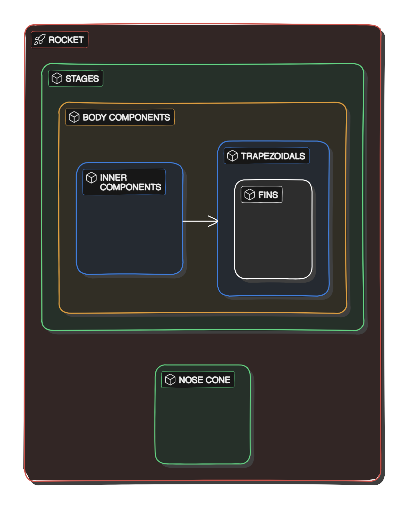

# Лабораторная №5
- [Лабораторная №5](#лабораторная-5)
  - [Задание](#задание)
  - [Схемы](#схемы)
    - [Наследование компонентов ракеты](#наследование-компонентов-ракеты)
    - [Композиция ракеты](#композиция-ракеты)
    - [Стадии полёта ракеты](#стадии-полёта-ракеты)
  - [Комментарии и идеи](#комментарии-и-идеи)
    - [ПМИшные комментарии](#пмишные-комментарии)
  - [Материалы](#материалы)

## Задание

В которой нужно реализовать консольное приложение, которое реализует управление коллекцией объектов в интерактивном режиме. В коллекции необходимо хранить объекты класса ``Route``, описание которого приведено ниже:
```
public class Route {
    private int id; //Значение поля должно быть больше 0, Значение этого поля должно быть уникальным, Значение этого поля должно генерироваться автоматически
    private String name; //Поле не может быть null, Строка не может быть пустой
    private Coordinates coordinates; //Поле не может быть null
    private java.time.ZonedDateTime creationDate; //Поле не может быть null, Значение этого поля должно генерироваться автоматически
    private Location from; //Поле может быть null
    private Location to; //Поле не может быть null
    private Long distance; //Поле не может быть null, Значение поля должно быть больше 1
}
public class Coordinates {
    private int x; //Максимальное значение поля: 751
    private Double y; //Максимальное значение поля: 238, Поле не может быть null
}
public class Location {
    private long x;
    private Float y; //Поле не может быть null
    private String name; //Длина строки не должна быть больше 208, Поле может быть null
}
public class Location {
    private Float x; //Поле не может быть null
    private int y;
    private Long z; //Поле не может быть null
}
```
Также в программу требуется добавить:
- [ ] Класс, коллекцией экземпляров которого управляет программа, должен реализовывать сортировку по умолчанию.
- [ ] Все требования к полям класса (указанные в виде комментариев) должны быть выполнены.
- [ ] Для хранения необходимо использовать коллекцию типа java.util.HashSet
- [ ] При запуске приложения коллекция должна автоматически заполняться значениями из файла.
- [ ] Имя файла должно передаваться программе с помощью: аргумент командной строки.
- [ ] Данные должны храниться в файле в формате csv
- [ ] Чтение данных из файла необходимо реализовать с помощью класса java.io.InputStreamReader
- [ ] Запись данных в файл необходимо реализовать с помощью класса java.io.FileOutputStream
- [ ] Все классы в программе должны быть задокументированы в формате javadoc.
- [ ] Программа должна корректно работать с неправильными данными (ошибки пользовательского ввода, отсутсвие прав доступа к файлу и т.п.).

В интерактивном режиме программа должна поддерживать выполнение следующих команд:
- help : вывести справку по доступным командам
- info : вывести в стандартный поток вывода информацию о коллекции (тип, дата инициализации, количество элементов и т.д.)
- show : вывести в стандартный поток вывода все элементы коллекции в строковом представлении
- add {element} : добавить новый элемент в коллекцию
- update id {element} : обновить значение элемента коллекции, id которого равен заданному
- remove_by_id id : удалить элемент из коллекции по его id
- clear : очистить коллекцию
- save : сохранить коллекцию в файл
- execute_script file_name : считать и исполнить скрипт из указанного файла. В скрипте содержатся команды в таком же виде, в котором их вводит пользователь в интерактивном режиме.
- exit : завершить программу (без сохранения в файл)
- remove_greater {element} : удалить из коллекции все элементы, превышающие заданный
- remove_lower {element} : удалить из коллекции все элементы, меньшие, чем заданный
- history : вывести последние 15 команд (без их аргументов)
- remove_all_by_distance distance : удалить из коллекции все элементы, значение поля distance которого эквивалентно заданному
- filter_starts_with_name name : вывести элементы, значение поля name которых начинается с заданной подстроки
- print_field_descending_distance : вывести значения поля distance всех элементов в порядке убывания

## Схемы

### Наследование компонентов ракеты


 Подробнее: https://app.eraser.io/workspace/a1ddOea1jwJJCEwztSbC?elements=CUuNWfsUtwZ1Eq6dRdUbKg

### Композиция ракеты


### Стадии полёта ракеты


## Комментарии и идеи

### ПМИшные комментарии
- [ ] разобраться с calcMovement
- [ ] добавить бургер паттерн

## Материалы
- [Схемы](https://app.eraser.io/workspace/a1ddOea1jwJJCEwztSbC?origin=share&elements=CUuNWfsUtwZ1Eq6dRdUbKg)
